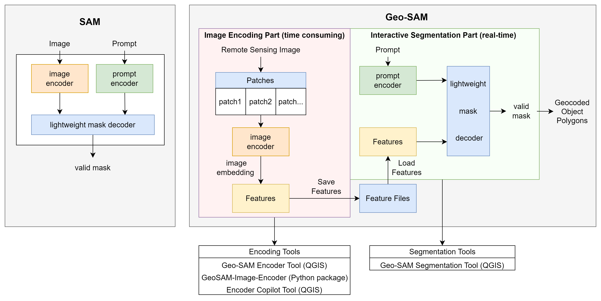
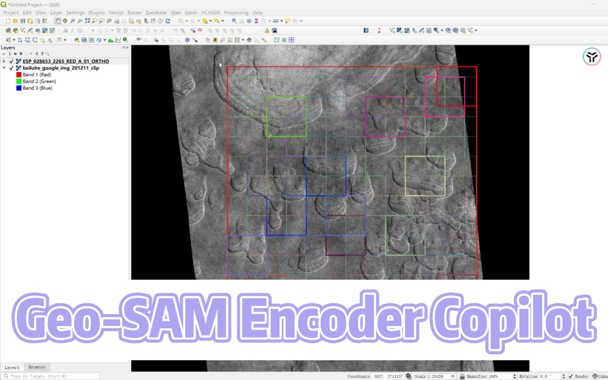

# Geo SAM

[](https://zenodo.org/record/8191039) [](https://geo-sam.readthedocs.io/en/latest/?badge=latest)

By [Zhuoyi Zhao](https://github.com/coolzhao/) and [Chengyan Fan](https://github.com/Fanchengyan) from [Cryosphere Lab](https://cryocuhk.github.io/), ESSC, CUHK.

- [Introduction](#introduction)
- [Installation and Usage](#installation-and-usage)
- [Demos](#demos)
- [Highlights](#highlights)
- [Notes](#notes)
- [Citation](#citation)
- [Acknowledgement](#acknowledgement)

## Introduction

Geo-SAM is a QGIS plugin that aims to help people segment, delineate or label landforms efficiently when using large-size geospatial raster images. [Segment Anything Model](https://segment-anything.com/) (SAM) is a foundation AI model with the superpower, but the model size is huge, and using it to process images can take a long time, even with a modern GPU. Our tool uses the strategies of encoding image features in advance and trimming the SAM model. **The interactive segmentation algorithm can perform real-time inference (at `millisecond` speeds) on a laptop CPU**, making it a convenient and efficient tool for dealing with remote sensing images.

The Geo-SAM plugin includes two separate parts: the **Image Encoding Part**, and the **Interactive Segmentation Part**. The image encoding part is designed to generate and save the image features using the SAM image encoder, and the encoding process only needs to run once per image. The segmentation part is for interactively segmenting landforms, and it can only be used to segment preprocessed images (whose features have been generated in advance using the encoding tool, as the included demo image).

|  |
|:--:|
| *Comparison of the workflow between Geo-SAM and the original SAM. original SAM package encodes prompts and image simultaneously, while the Geo-SAM model encodes image into feature files at once and queries prompts in real-time (at `millisecond` speeds) by loading those saved features.* |

## Installation and Usage

- [How to install?](https://geo-sam.readthedocs.io/en/latest/installation.html)
- [How to use?](https://geo-sam.readthedocs.io/en/latest/Usage/index.html)

## Demos

- Interactive Segmentation Demo (**millisecond-level response time after providing prompts**)

<p align="center">
  
</p>

- ``Preview Mode`` Demo for Interactive Segmentation  (**Execute SAM following the mouse cursor**)

<p align="center">
  
</p>

- Image Encoder Demo (QGIS plugin part)

<p align="center">
  
</p>

- Encoder Copilot Demo

<div align="center">
  <a href="https://youtu.be/NWemi3xcCd0"></a>
</div>

## Highlights

- Based on QGIS for a user-friendly GUI and cross-platform compatibility without programming skills needed.
- It provides segmentation results `instantly after giving prompts`, and can even display results `in real-time following the mouse cursor` (Preview mode, currently only available in the dev version, will be added to the stable version after being rigorously tested). Users can have a smooth, interactive experience.This can greatly improve the efficiency and user experience of segmentation.

## Notes

- SAM is designed to **segment one object once with a series of prompts**, so you should save the current results before getting to the next one when using the Geo-SAM tool.
- SAM natively supports only three-band images, but we have adapted Geo-SAM to support one or two-band images so that you can try grayscale images, spectral index images (like NDVI, NDWI), or even SAR images.
- The Geo-SAM plugin is currently in active development. We will continue making improvements and welcome your feedback. If you have any questions or suggestions, please feel free to open an issue or discussion on our GitHub repository at [GitHub Issues](https://github.com/coolzhao/Geo-SAM/issues) or [GitHub Discussions](https://github.com/coolzhao/Geo-SAM/discussions).

## Citation

> Zhao, Zhuoyi, Fan, Chengyan, & Liu, Lin. (2023). Geo SAM: A QGIS plugin using Segment Anything Model (SAM) to accelerate geospatial image segmentation (1.1.0). Zenodo. <https://doi.org/10.5281/zenodo.8191039>

```bibtex
@software{zhao_zhuoyi_2023_8191039,
  author       = {Zhao, Zhuoyi and Fan, Chengyan and Liu, Lin},
  title        = {{Geo SAM: A QGIS plugin using Segment Anything Model (SAM) to accelerate geospatial image segmentation}},
  month        = jul,
  year         = 2023,
  publisher    = {Zenodo},
  version      = {1.1.0},
  doi          = {10.5281/zenodo.8191039},
  url          = {https://doi.org/10.5281/zenodo.8191039}
}
```

## Acknowledgement

This repo benefits from [Segment Anything](https://github.com/facebookresearch/segment-anything) and [TorchGeo](https://github.com/microsoft/torchgeo). Thanks for their wonderful work.
