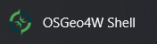
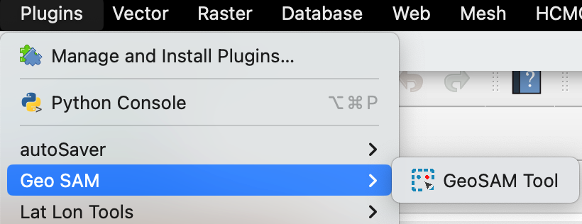
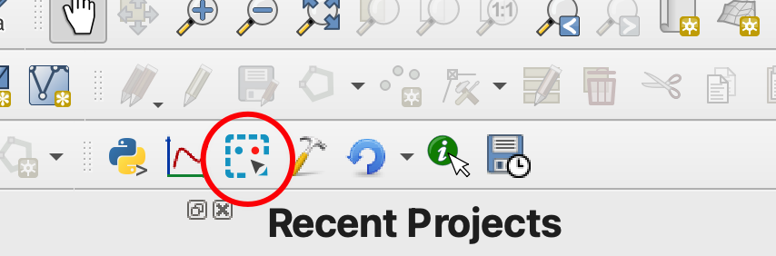
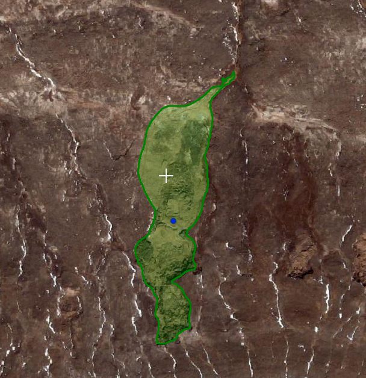
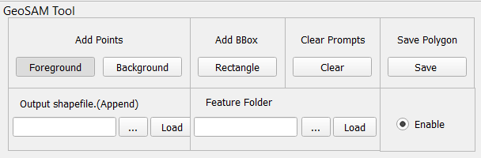
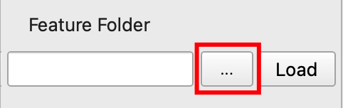

# Geo SAM

By Joey and [Fancy](https://github.com/Fanchengyan) from [Cryosphere Lab](https://cryocuhk.github.io/), ESSC, CUHK.

- [Geo SAM](#geo-sam)
  - [Introduction](#introduction)
  - [Installation](#installation)
    - [Install QGIS](#install-qgis)
    - [Install Library Dependencies](#install-library-dependencies)
      - [For Windows Users](#for-windows-users)
      - [For Mac or Linux Users](#for-mac-or-linux-users)
    - [Install the Geo SAM Plugin](#install-the-geo-sam-plugin)
      - [Download the Plugin](#download-the-plugin)
      - [Locate the QGIS Plugin folder](#locate-the-qgis-plugin-folder)
      - [Activate the Geo SAM Plugin](#activate-the-geo-sam-plugin)
  - [Use the Geo SAM Segmentation Tool](#use-the-geo-sam-segmentation-tool)
    - [Add Prompts](#add-prompts)
    - [Save Current Results](#save-current-results)
    - [Undo/Clear Prompts](#undoclear-prompts)
    - [Enable/Disable the Tool](#enabledisable-the-tool)
    - [Load Image Features](#load-image-features)
    - [Shortcuts](#shortcuts)
    - [Tips for Using the Segmentation Tool](#tips-for-using-the-segmentation-tool)
  - [Use the Geo SAM Encoding Tool](#use-the-geo-sam-encoding-tool)
    - [Download SAM Checkpoints](#download-sam-checkpoints)
    - [Select Bands and Value Range for Processing](#select-bands-and-value-range-for-processing)
    - [Patch Sampling](#patch-sampling)
    - [Demo Animation](#demo-animation)
    - [Tips for Making the Encoding Process Faster](#tips-for-making-the-encoding-process-faster)
  - [Future Works](#future-works)
  - [Citation](#citation)
  - [Acknowledgement](#acknowledgement)

## Introduction

Geo SAM is a QGIS plugin that aims to help people segment, delineate or label landforms efficiently when using large-size geospatial raster images. [Segment Anything Model](https://segment-anything.com/) (SAM) is a foundation AI model with the superpower, but the model size is huge, and using it to process images can take a long time, even with a modern GPU. Our tool uses the strategies of encoding image features in advance and trimming the SAM model. The interactive segmentation process can be run in real-time on a laptop by only using a CPU, making it a convenient and efficient tool for dealing with satellite images.

The Geo SAM plugin includes two separate tools, the encoding tool, and the segmentation tool. The encoding tool is designed to generate and save the image features using the SAM image encoder, and the encoding process only needs to run once per image. The segmentation tool is for interactively segmenting landforms, and it can only be used to segment preprocessed images (whose features have been generated in advance using the encoding tool, as the included demo image).

## Installation

### Install QGIS

You are suggested to install the latest version of [QGIS](https://www.qgis.org/en/site/forusers/download.html) since the plugin has only been tested on versions newer than QGIS 3.30.

### Install Library Dependencies

#### For Windows Users

<!--  -->

<p align="left">
  Open the <b>OSGeo4W Shell</b>
   application from the Start menu, which is a dedicated shell for the QGIS. Then run the following command to install the libraries.
</p>

```bash
pip3 install torch torchvision
pip3 install torchgeo
pip3 install segment-anything
```

Our encoder tool now supports using CUDA GPU to accelerate the encoding process. If your PC has dedicated CUDA GPUs, you can install the CUDA library first and then install the gpu-version pytorch using the following command (using CUDA version 11.7 as an example):

```bash
# add `--force-reinstall` if you installed the cpu version before.
pip3 install torch torchvision torchaudio --index-url https://download.pytorch.org/whl/cu117
```

#### For Mac or Linux Users

Open your own terminal application, and change the directory to where the QGIS Python binary file locates.

```bash
# Mac
cd /Applications/QGIS.app/Contents/MacOS/bin
# Linux (Please confirm the python env by "import qgis")
cd /usr/bin
```

To confirm the QGIS Python environment:

```bash
./python3
>>> import qgis
```

Then install the libraries.

```bash
# !important, add ./ to avoid using your default Python in the system
./pip3 install torch torchvision
./pip3 install torchgeo
./pip3 install segment-anything
```

For Linux users, if `pip3` is not found in `/usr/bin`, try the following commands:

```bash
sudo apt-get update
sudo apt-get install python3-pip
```

For Linux users, if your computer got available CUDA GPUs and with CUDA library installed, the above commands should have helped you install the gpu-version pytorch. You can reach [pytorch official website](https://pytorch.org/get-started/locally/) for more information.

### Install the Geo SAM Plugin

#### Download the Plugin

Download the [plugin zip file](https://github.com/coolzhao/Geo-SAM/releases/latest), unzip it, and rename the folder as `Geo-SAM` (be aware of undesired nested folders after unzipping).

#### Locate the QGIS Plugin folder

In QGIS, Go to the menu `Settings` > `User Profiles` > `Open active profile folder.`  You'll be taken straight to the profile directory. Under the profile folder, you may find a `python` folder; the `plugins` folder should be right inside the `python` folder (create the `plugins` folder if it does not exist). Put the entire `Geo-SAM` folder inside the `plugins` folder, then restart QGIS. The directory tree structure should be the same as the following.

```txt
python
└── plugins
    └── Geo-SAM
        ├── checkpoint
        ├── docs
        ├── ...
        ├── tools
        └── ui
```

Below are some general paths of the plugin folder for your reference.

```bash
# Windows
%APPDATA%\QGIS\QGIS3\profiles\default\python\plugins
# Mac
~/Library/Application\ Support/QGIS/QGIS3/profiles/default/python/plugins
# Linux
~/.local/share/QGIS/QGIS3/profiles/default/python/plugins
```

#### Activate the Geo SAM Plugin

After restarting QGIS, go to the menu `Plugins` > `Manage and Install Plugins`, and under `Installed`, you may find the `Geo SAM` plugin; check it to activate the plugin.

<p align="center">
  
</p>

After activating the Geo SAM plugin, you may find the Geo SAM tools under the `Plugins` menu,

<p align="center">
  
</p>

You may also find a new toolbar, including two icons.

<p align="center">
  
</p>

## Use the Geo SAM Segmentation Tool

Click the `Segmentation Tool` icon to open the interactive segmentation widget. You will be shown a demo raster image with thaw slump and small pond landforms for you to try the tool. With a single click on the map, a segmentation result will be generated.

<!--  -->

<p align="center">
  
</p>

A user interface will be shown below.

<!--  -->

<p align="center">
  
</p>

### Add Prompts

Click the buttons to select between the `Foreground(FG)` and `Background(BG)` points. Use `FG` points to add areas you desire, and use `BG` points to remove areas you don't want.

Click the `BBox` button to choose to add a bounding box (BBox) on the canvas by pressing and dragging the mouse. BBox can be used together with adding points or independently.

### Save Current Results

After adding points and a BBox for segmenting a subject, you can save the segmentation results by clicking the `Save` button.

### Undo/Clear Prompts

You can use the `Undo` button to undo the last point or BBox prompt.

You can use the `Clear` button to clear the added points and BBox.

### Enable/Disable the Tool

You can uncheck the `Enable` button to temporally disable the tool and navigate on the map.

### Load Image Features

The plugin is initialized with features for demo purposes, and you can use the `Feature Folder` selection button to select the folder that includes the image features you need.

<p align="center">
  
</p>

Then, press the `Load` button to load the selected image features. Remember to add the corresponding raster image to the QGIS project.

### Shortcuts

- `Tab`: loop between 3 prompt types (the cursor will also change to the corresponding types)
- `C`: clear all prompts in canvas [same as `Clear` button]
- `Z`: undo the last prompt in canvas [same as `Undo` button]
- `S`: save SAM output features into polygon [same as `Save` button]
- `Ctrl+Z` or `command+Z`: undo the last saved segmentation results

### Tips for Using the Segmentation Tool

- Deal with only **One Subject** each time
- Use **Background Points** to exclude unwanted parts
- Use **Bounding Box (BBox)** to limit the segment polygon boundary
- The **BBox** should cover the entire subject
- Remember to press the `Save` button after the segmentation of the chosen subject

## Use the Geo SAM Encoding Tool

If you want to try your own images, you can use the Encoding Tool. This tool helps to preprocess geospatial images and generate image features using the SAM image encoder. The generated image features can then be used in our Geo-SAM tool to label the landforms by adding points and bounding box prompts.

### Download SAM Checkpoints

SAM model checkpoints should be downloaded in advance, and three versions (huge, large, and base) are available. The large version "vit_l" is recommended to try first. You need to specify the model type that matches the checkpoint version. Using the following links to download the checkpoints.

- `vit_h`: [ViT-H SAM model.](https://dl.fbaipublicfiles.com/segment_anything/sam_vit_h_4b8939.pth)
- `vit_l`: [ViT-L SAM model.](https://dl.fbaipublicfiles.com/segment_anything/sam_vit_l_0b3195.pth)
- `vit_b`: [ViT-B SAM model.](https://dl.fbaipublicfiles.com/segment_anything/sam_vit_b_01ec64.pth)

### Select Bands and Value Range for Processing

After selecting the raster layer or image file you want to process, you should also choose the proper bands. The SAM natively supports only three-band RGB images, but we have adapted the tool to support one or two-band images so that you can try grayscale images or NDVI spectral index images.

The values of the image input to the SAM should range from 0 to 255, and you may need to specify the value range (in `Advanced Parameters`) to be rescaled to [0, 255]. By default, the tool will help you to find the min and max values of the image data and rescale the value range of [min, max] to [0, 255].

### Patch Sampling

Since SAM only supports input images with sizes of (1024, 1204), small images will be resized to match the input size, while large images will be sampled into overlapped patches (patch_size=1024) in a grid-like fashion. The stride parameter will determine the overlap behavior, overlap = patch_size - stride.

### Demo Animation

The following animation shows how to use the encoder tool.

<p align="center">
  
</p>

After processing the image, by default, the generated features will automatically be loaded in the segmentation tool for you to start labeling. Or you can choose to load the image features manually afterward.

### Tips for Making the Encoding Process Faster

- Choose a smaller processing extent
- Reduce target resolution (in `Advanced Parameters`)
- Increase stride to minimize overlap
- Choose a smaller version of SAM model
- Use GPU
- Increase batch_size when using a GPU with sufficient GPU memory

## Future Works

- Existing polygon refinement

## Citation

> Zhao, Zhuoyi, Fan, Chengyan, & Liu, Lin. (2023). Geo SAM: A QGIS plugin using Segment Anything Model (SAM) to accelerate geospatial image segmentation (1.1.0). Zenodo. https://doi.org/10.5281/zenodo.8191039

```bibtex
@software{zhao_zhuoyi_2023_8191039,
  author       = {Zhao, Zhuoyi and Fan, Chengyan and Liu, Lin},
  title        = {{Geo SAM: A QGIS plugin using Segment Anything Model (SAM) to accelerate geospatial image segmentation}},
  month        = jul,
  year         = 2023,
  publisher    = {Zenodo},
  version      = {1.1.0},
  doi          = {10.5281/zenodo.8191039},
  url          = {https://doi.org/10.5281/zenodo.8191039}
}
```

## Acknowledgement

This repo benefits from [Segment Anything](https://github.com/facebookresearch/segment-anything) and [TorchGeo](https://github.com/microsoft/torchgeo). Thanks for their wonderful work.
