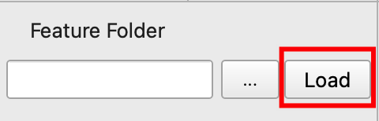

# Geo SAM

By Joey and [Fancy](https://github.com/Fanchengyan) from [CryoLab](https://cryocuhk.github.io/), ESSC, CUHK.

## Introduction

Geo SAM is a tool that aims to help people segment, delineate or label landforms efficiently when using large-size geo-spatial raster images. [Segment Anything Model](https://segment-anything.com/) (SAM) is a foundation AI model with super power, but the model size is huge and using it to process images can take a long time even with a modern GPU. Our tool uses the strategies of encoding image features in advance and trimming the SAM model, the interactive segmentation process can be run in real-time on a laptop by only using CPU, making it a convenient and efficient tool to deal with satellite images.

## Installation

### Install QGIS

You are suggested to install the latest version of [QGIS](https://www.qgis.org/en/site/forusers/download.html), since the plugin has only been tested on the versions newer than QGIS 3.30 (at least ver. 3.28 is recommended).

### Install Library Dependencies

#### For Windows Users


<!-- <p align="center">
   -->
  <!--  -->
<!-- </p> -->

Open the `OSGeo4W Shell` application from Start menu, which is a dedicated shell for the QGIS. Then run the following command to install the libraries.

```bash
pip3 install torch==1.13.1 torchvision==0.14.1
pip3 install torchgeo
pip3 install segment-anything
pip3 install rasterio==1.3.7
```

#### For Mac or Linux Users

Open your own terminal application, and change the directory to the QGIS Python environment.

```bash
# Mac
cd /Applications/QGIS.app/Contents/MacOS/bin
# Linux (not confirmed)
cd /<qgispath>/share/qgis/python
```

Then install the libraries.

```bash
# add ./ to avoid using your default python in the system
./pip3 install torch==1.13.1 torchvision==0.14.1
./pip3 install torchgeo
./pip3 install segment-anything
./pip3 install rasterio==1.3.7
```

### Install the GeoSAM Plugin

Download the [plugin zip file](https://github.com/coolzhao/Geo-SAM/archive/refs/heads/main.zip), unzip it (avoid nested folder after unzipping) and put the contents in the QGIS plugin folder, then restart QGIS.

#### How to Locate the QGIS Plugin folder

From the `Settings` Menu, select `User Profiles`, then select `Open active profile folder.`  You'll be taken straight to the profile directory in Explorer or Finder. Under the profile folder you may find a `python` folder, the `plugins` folder should be right inside the python folder. Open the `plugins` folder, then put the entire `Geo-SAM`(or `Geo-SAM-main`) folder in it, then restart QGIS.

Below are some general paths of different systems for your reference.

```bash
# Windows
%APPDATA%\QGIS\QGIS3\profiles\default\python\plugins
# Mac
~/Library/Application\ Support/QGIS/QGIS3/profiles/default/python/plugins
# Linux
~/.local/share/QGIS/QGIS3/profiles/default/python/plugins
```

#### Activate Geo SAM Plugin

After restarting QGIS, you may go to the `Plugins` menu, select `Manage and Install Plugins`, under `Installed`, you may find the `Geo SAM` plugin, check it to activate the plugin.


#### Find the Geo SAM Tool

After activating the Geo SAM plugin, you may find the tool under the `Plugins` menu,

<p align="center">
  
</p>

or somewhere on the toolbar near the Python Plugin.

<p align="center">
  
</p>

## Use the GeoSAM Tool

Click the toolbar icon to open the widget of the tool. You will be shown a demo raster image with thaw slump and small pond landforms for you to try the tool. With a single click on the map, a segmentation result will be generated.


A user interface will be shown as below.


### Add Points

Click the buttons to select between `Foreground` and `Background` points. Use `Foreground` points to add areas you desire, and use `Background` points to remove areas you don't want.

### Add Bounding Box (BBox)

Click the `Rectangle` button to active the BBox tool to draw a rectangle on the map for segmenting a subject.
The BBox tool can be used together with adding points or independently.

### Save Current Results

After adding points and rectangle for segmenting a subject, you can save the segmentation results by click the `Save` button.

### Clear Points and BBox

You can use the `Clear` button to clear the added points and rectangles.

### Disable the Tool

You can uncheck the `Enable` button to temporally disable the tool and navigate on the map.

### Load Selected Image Features

The plugin is initialized with features for demo purpose, you can use the `Feature Folder` selection tool to select the folder that include the image features you need.

<p align="center">
  
</p>

After selecting the feature folder, you may press the `Load` button to load the features, it may take several seconds when you load the folder for the first time. Remember to add the corresponding raster image to the QGIS project.

<p align="center">
  
</p>

## Tips for Using GeoSAM Tool

- Deal with only **One Subject** each time
- Use **Background Points** to exclude unwanted parts
- Use **Bounding Box (BBox)** to limit the segment polygon boundary
- The **BBox** should cover the entire subject
- Remember to press `Save` button after the segmentation of the chosen subject

## Future Works

- Image encoder module
- Existing polygon refinement

## Acknowledgement

This repo benefits from [Segment Anything](https://github.com/facebookresearch/segment-anything) and [TorchGeo](https://github.com/microsoft/torchgeo). Thanks for their wonderful works.
