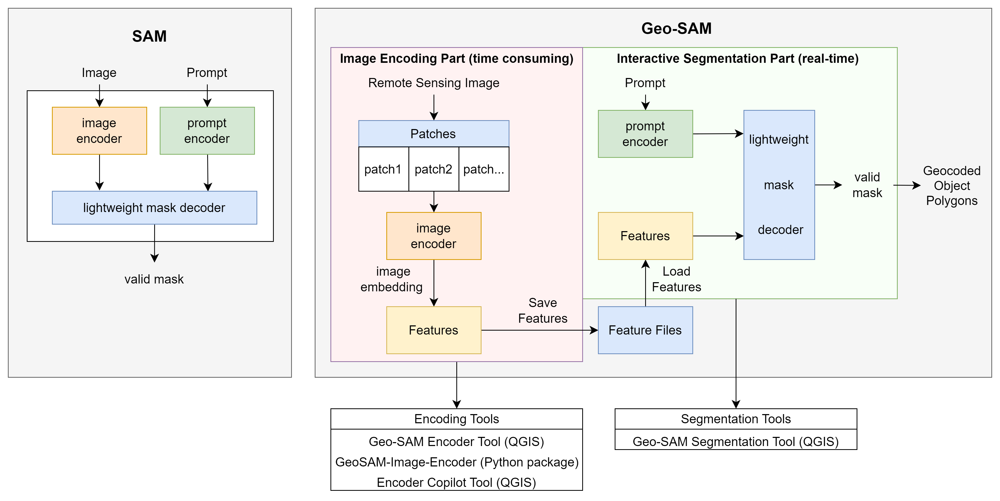
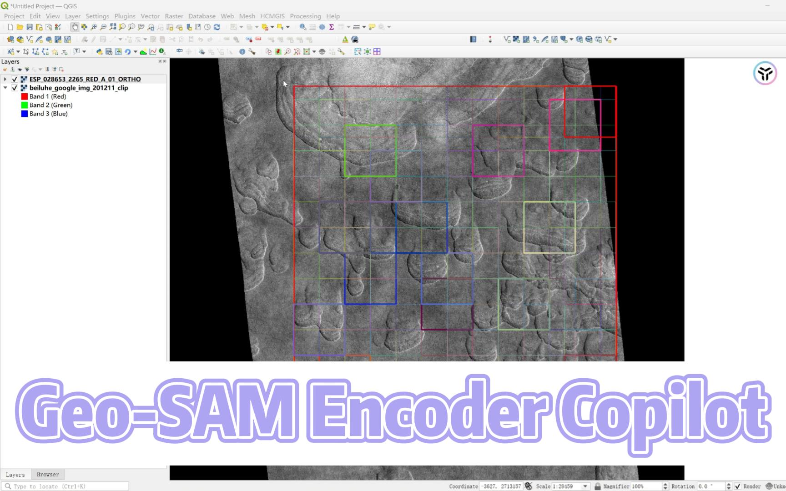

# Geo SAM

> 🎉 **GeoSAM is now on the [QGIS Official Plugin Repository](https://plugins.qgis.org/)!**
> Install and update Geo-SAM directly from the QGIS Plugin Manager --
> **Plugins > Manage and Install Plugins**, search for "Geo SAM", and click
> Install. No manual download needed.

By [Zhuoyi Zhao](https://github.com/coolzhao/) (Joey) and [Chengyan Fan](https://github.com/Fanchengyan) (Fancy) from [Cryosphere Lab](https://cryocuhk.github.io/), ESSC, CUHK.

- [Geo SAM](#geo-sam)
  - [Introduction](#introduction)
  - [What's New in GeoSAM v2.0](#whats-new-in-geosam-v20)
  - [Installation and Usage](#installation-and-usage)
  - [Demos](#demos)
  - [Citation](#citation)
  - [Acknowledgement](#acknowledgement)

## Introduction

Geo-SAM is a QGIS plugin that helps you segment, delineate, and label
landforms efficiently in large geospatial raster images. It is built on the
[Segment Anything Model](https://segment-anything.com/) (SAM) and uses the
strategies of encoding image features in advance and stripping the heavy image
encoder from inference. **The interactive segmentation runs at `millisecond`
speeds on a laptop CPU**, making it a convenient and efficient tool for remote
sensing image analysis.

Since v2.0, Geo-SAM provides two segmentation workflows:

- **Live Encoding mode** -- select a raster layer and a SAM model, then start
  segmenting. Features are encoded on the fly using QGIS background tasks and
  cached for fast re-queries. No pre-encoding required.
- **Pre-encoded mode** -- use the Image Encoder to generate reusable feature
  files, then load them in the Segmentation tool. Best for repeated
  segmentation of the same image.

|  |
|:--:|
| *Comparison of the workflow between Geo-SAM and the original SAM. The original SAM encodes prompts and image simultaneously, while Geo-SAM encodes image features in advance and queries prompts at `millisecond` speeds by loading saved features.* |

## What's New in GeoSAM v2.0

- **Live Encoding mode** -- no pre-encoding needed for quick exploration.
- **`geosam` core library backbone** -- replaces the internal implementation
  with a dedicated geospatial SAM library.
- **SAM3 model support** -- SAM, SAM 2, SAM 2.1, and SAM 3 model families.
- **Plugin-managed dependencies** -- one-click dependency installation into
  an isolated, plugin-private directory. No manual `pip` commands.
- **Unified Settings dialog** -- Dependencies, Model Management, Cache, and
  Help in one place.
- **Online tile layer support** -- segment directly from XYZ/WMS tile layers.
- **Vectorization modes** -- Pixel-Level or Simplified polygon output.
- **Max Polygon Only mode** -- keep only the largest polygon from each mask.
- **Split-panel UI** -- cleaner layout with Input/Output + Prompts on the
  left, Styles + Options on the right.
- **Async preview pipeline** -- smoother preview as you move the mouse.
- **Multi-language UI** -- the interface is translated into 中文, 日本語,
  한국어, Français, Русский, العربية, Deutsch, Español, and Português,
  following the QGIS locale setting automatically.

See the [changelog](https://geo-sam.readthedocs.io/en/latest/changelog.html)
for the full list of changes.

## Installation and Usage

Read the documentation for more details: <https://geo-sam.readthedocs.io/en/latest/>.

Quick start:

1. Install the Geo-SAM plugin from the QGIS Plugin Manager.
2. Open **Geo-SAM Settings** > **Dependencies** > **Install Missing**.
3. Restart QGIS.
4. Open **Geo-SAM Settings** > **Model Management** > download a model
   (e.g., SAM2.1 Base).
5. Click the **Geo-SAM Segmentation** icon, select an image layer and model,
   and start labelling.

See the [Quick Start guide](https://geo-sam.readthedocs.io/en/latest/Usage/quickstart.html)
for a 5-minute walkthrough.

## Demos

- Live Encoding Demo (**millisecond-level response time after providing prompts**)

<p align="center">
  
</p>

- ``Preview Mode`` Demo (**Run SAM following the mouse cursor**)

<p align="center">
  
</p>

- Image Encoder Demo (QGIS plugin part)

<p align="center">
  
</p>

- Encoder Copilot Demo

<div align="center">
  <a href="https://youtu.be/NWemi3xcCd0"></a>
</div>

## Citation

> Zhao, Zhuoyi, Fan, Chengyan, & Liu, Lin. (2023). Geo SAM: A QGIS plugin using Segment Anything Model (SAM) to accelerate geospatial image segmentation (2.0). Zenodo. <https://doi.org/10.5281/zenodo.8191039>

```bibtex
@software{zhao_zhuoyi_2023_8191039,
  author       = {Zhao, Zhuoyi and Fan, Chengyan and Liu, Lin},
  title        = {{Geo SAM: A QGIS plugin using Segment Anything Model (SAM) to accelerate geospatial image segmentation}},
  year         = 2023,
  publisher    = {Zenodo},
  version      = {2.0},
  doi          = {10.5281/zenodo.8191039},
  url          = {https://doi.org/10.5281/zenodo.8191039}
}
```

## Acknowledgement

This repo benefits from [Segment Anything](https://github.com/facebookresearch/segment-anything), [SAM 2](https://github.com/facebookresearch/sam2), [Ultralytics](https://github.com/ultralytics/ultralytics), [`geosam`](https://github.com/Fanchengyan/geosam), and [QGIS](https://www.qgis.org/). Thanks for their wonderful work.
