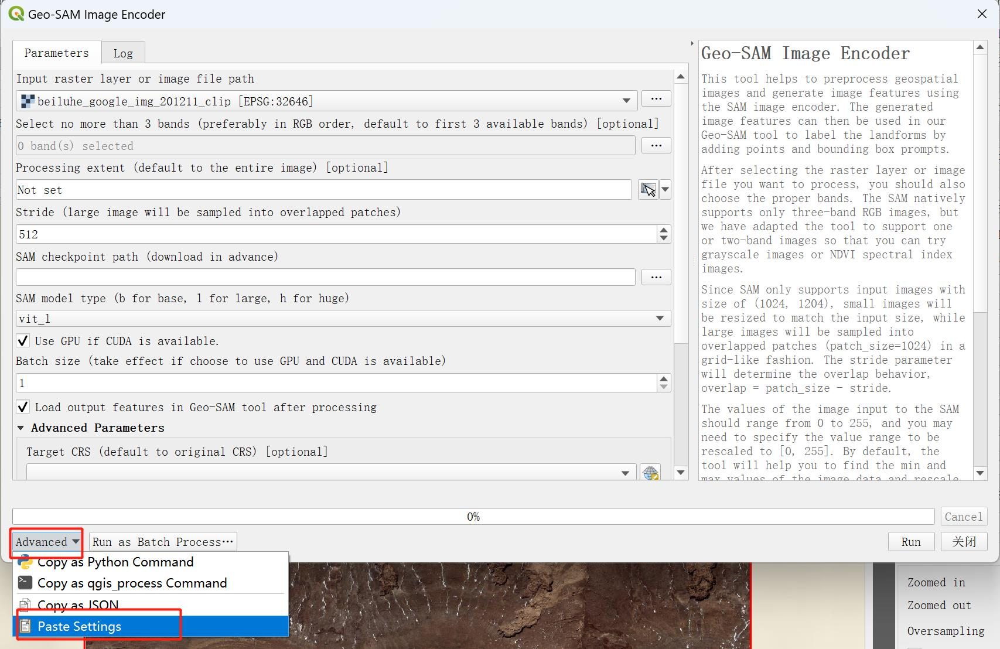

Encoder Copilot (QGIS plugin)
=============================

Background
----------

SAM only supports 1024x1024 pixel image inputs, but the pixels in our remote sensing images are generally much greater than this number. To solve this problem, we split the image into overlapping patches. After the user provides prompts, the patch which center closest to the center of the prompts is selected for SAM execution. However, if the spatial resolution of the image is too high or the area of the land surface objects is too large, 1024x1024 may not be able to cover those objects. To avoid this, the spatial resolution of image needs to be reduced. The ``Geo-SAM Image Encoder`` tool supports changing the output image resolution, but we usually don't know which value of resolution is appropriate. To allow the user to check in real time whether the patch size covers the desired objects under different resolutions, we designed the ``Encoder Copilot`` tool to display all patches under different resolutions and overlaps/strides in real time.

Usage
-----

Click the ``Encoder Copilot`` icon to open the interactive Encoder Copilot widget. Select the raster and bands you want to encode, and then set the extent to be processed. The extent can be calculated from the layer or drawn directly on the canvas. At this point, adjusting the resolution scale and overlap values will display the corresponding patches situation in real time. 

Besides, ``Encoder Copilot`` also supports direct setting of other parameters. You can specify the path of the SAM model checkpoint, and the model type will be automatically analyzed from the file name. If you change the file name of the checkpoint, the automatically detected model type may not be correct, you need to select it manually in this case. The value range supported by the SAM model is 0-255, but the value range of remote sensing images is usually not within this range. Our tool will automatically detect the value range of the image and stretch it to 0-255. Users can click on the “parse from raster” button in Copilot to directly detect the value range, or manually modify this value. If you do nothing, don’t worry, ``Geo-SAM Image Encoder`` tool can also automatically detect and stretch the value range.

Export Settings
---------------

Copy Settings to clipboard
~~~~~~~~~~~~~~~~~~~~~~~~~~

When the parameters are determined, the user can directly click the ``Copy Setting`` button in ``Encoder Copilot``. Then click ``Advanced`` -> ``Paste Settings`` in the ``Geo-SAM Image Encoder`` to paste the parameters into the tool.

Export Settings into a file
~~~~~~~~~~~~~~~~~~~~~~~~~~~

Users can also export the settings to a json file by click ``Export Settings`` button. This is useful to pass parameters to the :ref:`GeoSAM-Image-Encoder <Geo-SAM Image Encoder>` package.

Demo Animation
--------------

The following YouTube video shows how to use the ``Encoder Copilot``.

.. image:: ../_static/EncoderCopilotCover.jpg
    :alt: EncoderCopilotDemo
    :width: 95%
    :target: https://youtu.be/NWemi3xcCd0
    
     

    
