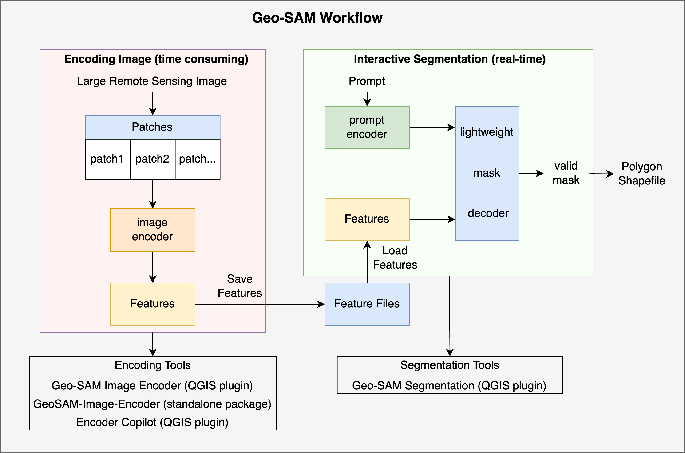

Usage of Geo-SAM Tools
======================

The workflow of using Geo-SAM tools is as follows:

1. Encode the image into feature files using the Geo-SAM encoder. The encoding process can be done either by:

   * QGIS plugin: `Geo-SAM Image Encoder (QGIS plugin) <geo-sam-encoder_qgis>`_  
   * A standalone Python package: `GeoSAM-Image-Encoder (Python package) <geo-sam-encoder_python_package>`_.

2. Open the `Geo-SAM Segmentation (QGIS plugin) <geo_sam_segmentation>`_ , Then:

   1. Select the encoded features generated in the previous step. 
   2. Load the image to the QGIS canvas. 
   3. Select the output shapefile directory for SAM results. 

Then, you can use the segmentation tool to segment the image.

----------------

.. toctree:: 
   :maxdepth: 1

   segmentation
   encoding
   encoder_package
   copilot

