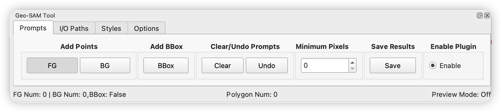
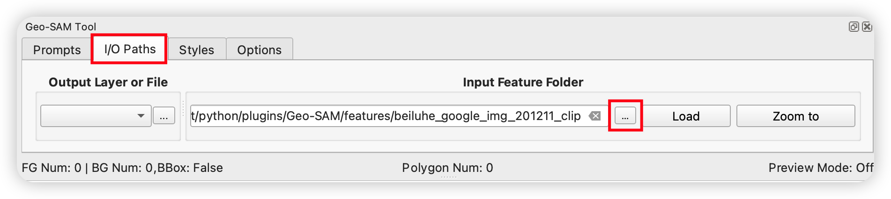

.. _geo_sam_segmentation:

Geo-SAM Segmentation (QGIS plugin)
==================================

Click the ``Geo-SAM Segmentation`` icon to open the interactive segmentation widget. You will be shown a demo raster image with thaw slump and small pond landforms for you to try the tool. With a single click on the map, a segmentation result will be generated.

.. image:: ../img/try_geo_sam.gif
    :alt: try_geo_sam
    :width: 500px
    :align: center

A user interface will be shown below.

There are 4 Tabs in the interface:

- **Prompts**: to add prompts (Foreground Point, Background Point, Bounding Box) and save the segmentation results
- **I/O Paths**: to load image features and specify the output layer or file
- **Styles**: to change the styles (colors/sizes) of the prompts and segmentation results
- **Options**: other options just like ``preview mode``, ``maximum polygon mode``, ``default minimum pixels``, etc.

I/O Paths Tab
-------------

Load Image Features
~~~~~~~~~~~~~~~~~~~

The plugin is initialized with features for demo purposes, and you can set the ``Input Feature Folder`` in the ``I/O Paths`` Tab to select the folder that includes the image features you need.

Then, press the ``Load`` button to load the selected image features. Remember to add the corresponding raster image to the QGIS project.

SAM Output Layer or File
~~~~~~~~~~~~~~~~~~~~~~~~

This is a shapefile file or layer used to save the segmentation results from SAM. You can specify it from: 

- the current layers in QGIS project (only support previous saved shapefile using this plugin)
- a file (will be created if not exist). 

.. note::
   If the output directory is not specified, a temporal file in memory will be created to store the segmentation results.
   Do remember to save this results to a file before closing the QGIS.

Prompts Tab
-----------

Add Prompts
~~~~~~~~~~~

There are 3 types of prompts: 

- ``FG (Foreground Point)``: a point that indicates the foreground of the object (desired area)
- ``BG (Background Point)``: a point that indicates the background of the object (undesired area)
- ``BBox (Bounding Box)``: a bounding box that limits the boundary of the object

.. note::

    - You can add multiple prompts for each type and combine them to segment one object.
    - You can use the ``Tab`` button to loop between the 3 prompt types. The cursor will also change to the corresponding types.

Undo/Clear Prompts
~~~~~~~~~~~~~~~~~~

- Press ``Undo`` button (Shortcut: ``Z``) to undo the last prompt.
- Press ``Clear`` button (Shortcut: ``C``) to clear all prompts and unsaved segmentation results.

Minimum Pixels
~~~~~~~~~~~~~~

The minimum pixels for the segmentation result. The object with fewer pixels than the ``Minimum Pixels`` value will be removed from the segmentation results. The ``Minimum Pixels`` will change to ``Default Minimum Pixels`` after saved the segmentation results.

Save Current Results
~~~~~~~~~~~~~~~~~~~~

You can save the segmentation results by clicking the ``Save`` button (Shortcut: ``S``), after adding points and a BBox prompts for segmenting a object.

Enable/Disable the Tool
~~~~~~~~~~~~~~~~~~~~~~~

You can uncheck the ``Enable`` button to temporally disable the tool and navigate on the map.

Styles Tab
------------

Colors
~~~~~~

Due to the diverse range of colors in remote sensing images, the default color scheme may closely resemble the image colors, making it difficult to differentiate. Therefore, we have added an option to modify colors in the Styles Tab. 

There are 3 types of colors for the Prompts:

- ``FG Color``: the color of the foreground point
- ``BG Color``: the color of the background point
- ``BBox Color``: the color of the bounding box

There are 3 types of colors for the segmentation results:

- ``Polygon Color``: the color of the segmentation results from pressed prompts
- ``Preview Color``: the color of the segmentation results in the preview mode (results that with mouse moving)
- ``Boundary Color``: the color of the Boundary of the image feature.

For the color of SAM output, you can change it by directly changing color of this layer in QGIS.

Point Size
~~~~~~~~~~

The size of the point prompts (Foreground/Background Point).

Options Tab
-----------

Preview mode
~~~~~~~~~~~~

To facilitate better labeling, we have developed a preview mode. In this mode, SAM's execution results are displayed **in real-time as you move the mouse**, allowing to observe the prompt's effect instantly. In this mode, users can choose the most suitable prompt without worrying about getting worse by adding new prompt, reducing the frequency of prompt modifications.

.. important::

    - The ``Preview mode`` is designed only for previewing purposes, and only the ``pressed prompts`` will be saved.
    - You can use the ``P`` key to toggle the ``Preview mode`` on/off.

.. image:: ../img/PreviewModeDemo.gif
    :alt: preview_mode
    :width: 500px
    :align: center

Max Polygon Only
~~~~~~~~~~~~~~~~

Enable/disable the maximum polygon mode. When enabled, only the polygon with the maximum area will be saved. This is useful when there are typically multiple polygons generated by the prompts and you only want to save the largest one.

Default Minimum Pixels
~~~~~~~~~~~~~~~~~~~~~~

The default minimum pixels for the segmentation result. The object with fewer pixels than the default value will be removed from the segmentation results. The ``Minimum Pixels`` will change to ``Default Minimum Pixels`` after saved the segmentation results.

Load Demo
~~~~~~~~~

enable/disable loading demos when open widget.

Show Boundary
~~~~~~~~~~~~~

enable/disable showing the boundary of the image feature in the canvas.

Reset To Default
~~~~~~~~~~~~~~~~

Reset all the settings (Styles and Options) to the default values.

Shortcuts
---------

- ``Tab``: loop between 3 prompt types (the cursor will also change to the corresponding types)
- ``P``: Toggle to enable/disable executing SAM with ``Preview mode``
- ``C``: clear all prompts in canvas [same as ``Clear`` button]
- ``Z``: undo the last prompt in canvas [same as ``Undo`` button]
- ``S``: save SAM output features into polygon [same as ``Save`` button]
- ``Ctrl+Z`` or ``command+Z``: undo the last saved segmentation results

Tips for Using the Segmentation Tool
------------------------------------

- Deal with only **One object** each time
- Use **Background Points** to exclude unwanted parts
- Use **Bounding Box (BBox)** to limit the segment polygon boundary
- The **BBox** should cover the entire object
- Remember to press the ``Save`` button after the segmentation of the chosen object
