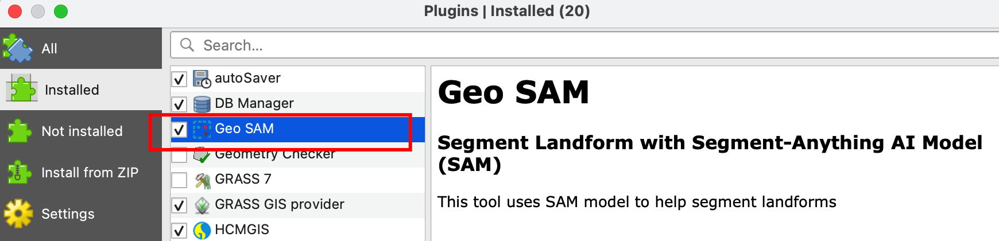
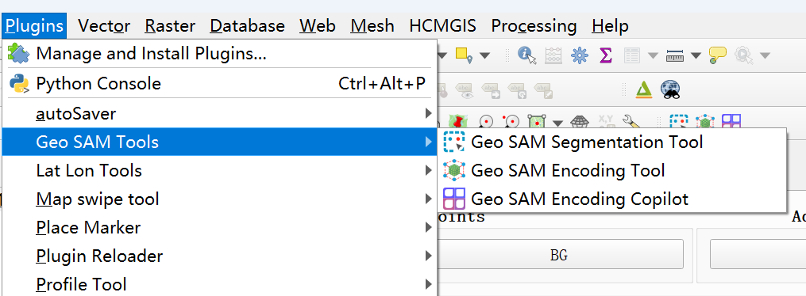

Installation
============

Install QGIS
------------


Geo-SAM is a plugin for QGIS, which needs to be installed first. 
It has primarily been tested with QGIS versions newer than 3.30, although QGIS 3.28 LTR should also work without issues. For optimal performance, we recommend installing the latest version of QGIS, which can be downloaded from the official website: `Download QGIS for your platform <https://www.qgis.org/en/site/forusers/download.html>`_. 

.. hint:: 
    If you encounter any issues installing QGIS through the official method, you can try installing it via ``conda``.

    To do this, create a new conda environment and install QGIS using the following command:

    .. code-block:: bash

        conda create -n qgis python=3.12 qgis -c conda-forge -y
    
    After the installation, you can activate the environment using:

    .. code-block:: bash

        conda activate qgis

    Then, you can run QGIS by typing:

    .. code-block:: bash

        qgis


Install Python Dependencies
---------------------------

For Windows Users
~~~~~~~~~~~~~~~~~

.. |OsGeo4WShell| image:: img/OsGeo4WShell.png
    :alt: OsGeo4WShell

Open the **OSGeo4W Shell** |OsGeo4WShell| application ``as Administrator`` from the Start menu, which is a dedicated shell for the QGIS. 


.. tab-set::

    .. tab-item:: CPU version

        If you want to install the CPU version of PyTorch, run the following command in the ``OSGeo4W Shell`` directly.

        .. code-block:: bash

            pip3 install torch torchvision torchgeo segment-anything

    .. tab-item:: GPU version

        ``Geo-SAM Encoder Tool`` supports using GPU to accelerate the encoding process. If your PC has NVIDIA GPUs, you need to download and install the `CUDA Toolkit <https://developer.nvidia.com/cuda-downloads>`_ first.

        Then install the gpu-version pytorch using the following command (here CUDA 11.7 as an example):

        .. code-block:: bash

            pip3 install torch torchvision torchaudio --index-url https://download.pytorch.org/whl/cu117

        .. tip::
            If you have installed the CPU version of PyTorch before, you need to add the ``--force-reinstall`` option to force the reinstallation of the GPU version.

            .. code-block:: bash
                
                pip3 install torch torchvision torchaudio --force-reinstall --index-url https://download.pytorch.org/whl/cu117 

        Then install the other dependencies:

        .. code-block:: bash

            pip3 install torchgeo segment-anything

For Mac/Linux Users
~~~~~~~~~~~~~~~~~~~~

.. hint::
    For Linux users with CUDA GPUs and the `CUDA Toolkit <https://developer.nvidia.com/cuda-downloads>`_ installed, following commands can help you install the gpu-version pytorch without any additional steps. You can reach `pytorch official website <https://pytorch.org/get-started/locally/>`_ for more information.


Open your own terminal application, and change the directory to where the QGIS Python binary file locates.

.. tab-set::
    .. tab-item:: MacOS

        .. code-block:: bash

            cd /Applications/QGIS.app/Contents/MacOS/bin

    .. tab-item:: Linux

        .. code-block:: bash

            cd /usr/bin


.. important::
    Do not ignore the ``./`` before ``python`` and ``pip`` in the following commands to avoid using your default Python/pip in the system


Run the following command to check if the QGIS Python environment is correctly set up.

.. code-block:: bash
    
    ./python3
    >>> import qgis

Then install the Python Dependencies of Geo-SAM.

.. code-block:: bash

    ./pip3 install torch torchvision torchgeo segment-anything

.. note::

    For Linux users, if ``pip3`` is not found in ``/usr/bin``, try the following commands:

    .. code-block:: bash

        sudo apt-get update
        sudo apt-get install python3-pip

.. warning::
    - **[Linux]: If latest QGIS crash when you try to run the plugin, you may need to downgrade the** ``rtree`` **package. The detailed reasons and solutions can be found in the following blog post:** `Crash on Latest QGIS in Linux <https://geo-sam.readthedocs.io/en/latest/blog/2024/05-02_crash_on_QGIS.html>`_. 
    
    Below is a brief guide for Ubuntu/Debian users:

    .. code-block:: bash
        
        # Remove the rtree package using pip in QGIS:
        ./pip3 uninstall rtree
        
        # Install the rtree package using system package manager:
        sudo apt-get install python3-rtree

    - **[MacOS]: If you encounter any Python error:** ``ValueError: numpy.dtype size changed, may indicate binary incompatibility. Expected 96 from C header, got 88 from PyObject``, **you may need to update** ``numpy`` **and** ``pandas`` **in QGIS**. (Currently, this issue seems to occur only on the macOS platform.):

    .. code-block:: bash
        
        ./pip3 install 'numpy<2' pandas -U
      

Install the Geo-SAM Plugin
--------------------------


Locate the QGIS Plugin folder
~~~~~~~~~~~~~~~~~~~~~~~~~~~~~

In QGIS, go to the menu ``Settings`` > ``User Profiles`` > ``Open active profile folder``.  You'll be taken straight to the profile directory. Under the profile folder, you may find a ``python`` folder; the ``plugins`` folder should be right inside the ``python`` folder (create the ``plugins`` folder if it does not exist). 

Below are some general paths of the plugin folder for your reference.

.. tab-set::
    .. tab-item:: Windows

        .. code-block:: bash

            %APPDATA%\QGIS\QGIS3\profiles\default\python\plugins

    .. tab-item:: MacOS

        .. code-block:: bash
            
            ~/Library/Application\ Support/QGIS/QGIS3/profiles/default/python/plugins

    .. tab-item:: Linux

        .. code-block:: bash

            ~/.local/share/QGIS/QGIS3/profiles/default/python/plugins


Download Plugin and Configure Folder
~~~~~~~~~~~~~~~~~~~~~~~~~~~~~~~~~~~~

1. Download the Plugin
``````````````````````

You can download the plugin in two ways: 

- manually downloading the plugin zip file 
- cloning the repository using git. 

.. tab-set::
    .. tab-item:: From zip file

        Manually downloading zip files from the GitHub repository is the most common way to install the plugin. 

        - **Download Plugin:**

        You can download compressed ``Source code`` file from GitHub release page: https://github.com/coolzhao/Geo-SAM/releases

        Then, unzip it, and rename the folder as ``Geo-SAM``.

        - **Update Plugin:**

        You can download the ``*_code_update.zip`` file to access the latest code updates. This file contains only the code, which significantly reduces both the file size and download time.

    .. tab-item:: From git

        If you are familiar with Git, you can clone the repository directly. This method is recommended if you want to update the plugin frequently.

        - **Download Plugin:**

        .. code-block:: bash

            git clone https://github.com/coolzhao/Geo-SAM.git

        - **Update Plugin:**

        .. code-block:: bash

            git pull

2. Configure the Plugin Folder
``````````````````````````````

Once the plugin is downloaded, place the entire ``Geo-SAM`` folder inside the ``plugins`` directory. The directory structure should resemble the following:

.. code-block:: bash
    :emphasize-lines: 2,3

    python
    └── plugins
        └── Geo-SAM
           ├── checkpoint
           ├── docs
           ├── ...
           ├── tools
           └── ui

.. warning::
   1. Remember to rename the folder as ``Geo-SAM`` after unzipping. You need to make sure the folder name is ``Geo-SAM``, not ``Geo-SAM-v1.3.1`` or ``Geo-SAM-v1.3-rc``. 
   2. Be aware of undesired nested folders after unzipping. Just like the following structure: ``Geo-SAM-v1.3.1/Geo-SAM/...``. You need to move the inner ``Geo-SAM`` folder to the ``plugins`` folder in this case.

Activate the Geo-SAM Plugin
~~~~~~~~~~~~~~~~~~~~~~~~~~~

Restart QGIS, go to the menu ``Plugins`` > ``Manage and Install Plugins``, and under ``Installed``, you will find the ``Geo SAM`` plugin; check it to activate the plugin.





After activating the Geo-SAM plugin, you may find the Geo SAM tools under the ``Plugins`` menu,




You can also find a new toolbar, including three icons.

.. image:: img/Toolbar_geo_sam.png
    :alt: Plugin toolbar
    :width: 33%
    :align: center

